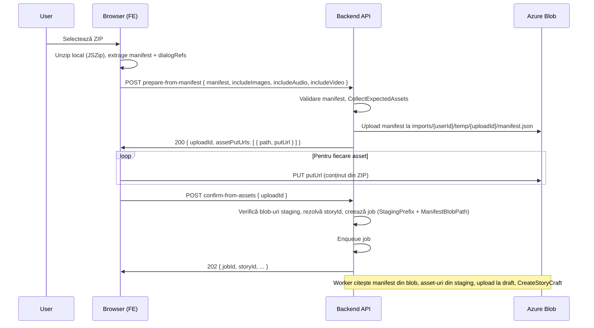

# Plan: Full Story Import – procesare ZIP în browser (client-side)

## Obiectiv

- Utilizatorul selectează fișierul ZIP în browser.
- **Browserul** deschide ZIP-ul local (JSZip), extrage manifestul (`story.json`) și eventual fișierele dialog (`dialogs/*.json`), construiește manifestul „inflated”.
- **Serverul** nu primește niciun ZIP: primește doar manifestul (la prepare) și la confirm doar `uploadId`.
- **Imaginile și audio/video** sunt încărcate **direct în Blob** (SAS) din browser; serverul nu procesează bytes pentru assets.
- Worker-ul existent citește manifestul din Blob și asset-urile din path-uri staging, apoi aplică același flux (upload la draft, CreateStoryCraftFromJson).

## Beneficii

- **Zero memorie server** pentru ZIP sau pentru bufferul de confirm: nu se mai descarcă niciun ZIP pe server.
- **Calcul în browser**: unzip + parsing pe calculatorul utilizatorului.
- **Assets direct în Blob**: fără trecere prin API pentru fișierele mari.

---

## Flux general

---

## 1. Backend – schimbări

### 1.1 Model `StoryImportJob`

- Adăugare câmpuri opționale (nullable):
  - **`StagingPrefix`** (string, null): prefix path în container draft, ex. `imports/{userId}/temp/{uploadId}`. Când e setat, worker-ul folosește asset-uri din staging, nu din ZIP.
  - **`ManifestBlobPath`** (string, null): path complet către manifest în Blob, ex. `imports/{userId}/temp/{uploadId}/manifest.json`.
- Interpretare:
  - Dacă `StagingPrefix` și `ManifestBlobPath` sunt setate → job „from assets”: worker citește manifestul de la `ManifestBlobPath` și asset-urile de la `StagingPrefix/assets/{relativePath}`.
  - Altfel → job clasic: worker citește ZIP de la `ZipBlobPath` (comportament actual).

### 1.2 Endpoint `POST /api/{locale}/stories/import-full/prepare-from-manifest`

- **Body:** `{ manifest: object, includeImages?: bool, includeAudio?: bool, includeVideo?: bool }`.
- **Auth:** Creator sau Admin (ca la import-full).
- **Validare:** aceleași reguli ca la citirea manifestului (id, tiles, extensii); folosește `CollectExpectedAssets(manifest, ..., includeImages, includeAudio, includeVideo)`.
- **Logică:**
  - Generează `uploadId` (Guid).
  - Staging prefix: `imports/{userId}/temp/{uploadId}`.
  - Salvează manifestul în Blob la `{stagingPrefix}/manifest.json` (serverul îl scrie).
  - Pentru fiecare intrare din `CollectExpectedAssets` (per `ZipPath` normalizat): generează SAS write pentru `{stagingPrefix}/assets/{normalizedPath}`, TTL (ex. 1h).
  - Răspuns: `{ uploadId, assetPutUrls: [ { path, putUrl } ] }` (path = path normalizat folosit și în ZIP).

### 1.3 Endpoint `POST /api/{locale}/stories/import-full/confirm-from-assets`

- **Body:** `{ uploadId }`.
- **Auth:** același user care a apelat prepare (sau Admin).
- **Logică:**
  - Staging prefix = `imports/{userId}/temp/{uploadId}`; manifest la `{stagingPrefix}/manifest.json`.
  - Verifică că blob-ul manifest există; citește manifestul din Blob, extrage `storyId`, rulează `ResolveStoryIdConflictAsync`.
  - Verifică job-uri blocate / active (ca la confirm-upload actual).
  - Verifică (opțional) că toate blob-urile din `{stagingPrefix}/assets/*` există (sau doar că manifestul e valid).
  - Creează `StoryImportJob`: `StagingPrefix` = staging prefix, `ManifestBlobPath` = path manifest, `ZipBlobPath` = null (sau gol), `StoryId` = finalStoryId, `OriginalStoryId` din manifest, IncludeImages/Audio/Video din prepare (trebuie stocate; vezi mai jos).
  - Publică eveniment + enqueue.
  - Răspuns: 202 Accepted cu `{ jobId, storyId, originalStoryId, status, queueName }`.

**Notă:** La prepare nu știm încă `finalStoryId` (se rezolvă la confirm). La confirm citim manifestul din Blob și aplicăm `ResolveStoryIdConflictAsync`. IncludeImages/Audio/Video pot fi stocate în blob împreună cu manifestul (ex. manifest wrapper) sau trimise din nou la confirm; varianta simplă: la confirm trimitem și `includeImages`, `includeAudio`, `includeVideo` în body și le setăm pe job.

### 1.4 Worker (StoryImportQueueWorker + ProcessImportJobAsync)

- Când job-ul are `ManifestBlobPath` (și `StagingPrefix`) setate:
  - Descarcă manifestul de la `ManifestBlobPath` (stream sau string).
  - Parsează JSON, (opțional) inflate dialogRef dacă în manifest sunt referințe (sau presupunem că clientul trimite deja manifest inflated).
  - `CollectExpectedAssets(root, ...)`.
  - Pentru fiecare asset: citește blob de la `{StagingPrefix}/assets/{normalizedPath}`, validează extensie/mărime, uploadează la `BuildDraftPath(asset, ...)` (același cod ca acum).
  - Apelează `CreateStoryCraftFromJsonAsync` (același cod).
  - La succes: șterge blob-urile din staging (manifest + assets).
- Când job-ul are `ZipBlobPath` (flux actual): comportament neschimbat (deschide ZIP, etc.).

---

## 2. Frontend – schimbări

### 2.1 Bibliotecă

- **JSZip** (sau similar) pentru deschiderea ZIP în browser.

### 2.2 Flux în UI (ex. același modal „Import full story”)

1. Utilizator alege fișier ZIP.
2. Citire ZIP cu JSZip:
   - Găsește intrarea `manifest/*/story.json` (sau `manifest/*/v*/story.json`).
   - Citește `story.json`, parsează JSON.
   - (Opțional) Pentru fiecare tile cu `dialogRef`, citește fișierul dialog din ZIP și înlocuiește în manifest (inflate) – ca pe server cu `InflateManifestDialogRefs`.
3. Apelează `prepare-from-manifest` cu `{ manifest, includeImages, includeAudio, includeVideo }`.
4. Primește `uploadId` și `assetPutUrls`.
5. Pentru fiecare `{ path, putUrl }`: găsește în ZIP intrarea cu `FullName`/path care se potrivește cu `path` (normalizat), extrage conținutul, face `fetch(putUrl, { method: 'PUT', body: blobOrArrayBuffer, headers: { 'x-ms-blob-type': 'BlockBlob', 'Content-Type': ... } })`.
6. După toate upload-urile: apelează `confirm-from-assets` cu `{ uploadId, includeImages, includeAudio, includeVideo }`.
7. Polling status job (același endpoint ca acum pentru import-full jobs).

### 2.3 Potrivire path ZIP vs server

- Serverul returnează `path` normalizat (ex. `media/images/cover/cover.png`). În ZIP, intrările pot avea `FullName` cu backslash-uri sau cu prefixe. FE normalizează: replace `\` -> `/`, trim, lowercase dacă e cazul, și potrivește cu `path` din răspuns.

---

## 3. Migrare DB

- Adăugare coloane la `StoryImportJobs`: `StagingPrefix` (nvarchar, null), `ManifestBlobPath` (nvarchar, null). Migrare EF + script SQL.

---

## 4. Ordine implementare

1. **DB + entity:** StagingPrefix, ManifestBlobPath pe StoryImportJob.
2. **Backend:** prepare-from-manifest (validare, upload manifest în blob, generare SAS per asset, return assetPutUrls).
3. **Backend:** confirm-from-assets (citire manifest din blob, resolve storyId, creare job cu staging).
4. **Worker:** ramură „from staging” în ProcessImportJobAsync (citire manifest + assets din blob, upload la draft, CreateStoryCraft, cleanup staging).
5. **FE:** JSZip, unzip local, prepare-from-manifest, upload assets la putUrl, confirm-from-assets, polling.

---

## 5. Siguranță / validare

- La prepare: validare manifest (id, tiles, tipuri), număr maxim de assets (config), extensii permise.
- La confirm: verificare că userul este același cu cel de la prepare (uploadId în path conține userId implicit).
- În worker: aceleași validări extensie/mărime per asset ca la fluxul ZIP; la eșec, job Failed și cleanup staging.

---

## 6. Compatibilitate

- Fluxul actual (upload ZIP întreg + confirm-upload cu ZIP în Blob) rămâne neschimbat pentru cazurile în care FE trimite încă ZIP (ex. fallback sau alte clienți). Worker-ul suportă ambele moduri (ZipBlobPath vs StagingPrefix + ManifestBlobPath).
